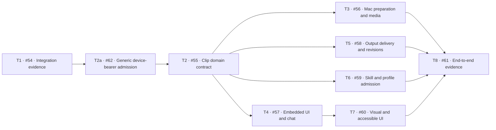

# Editing task graph

Recorded 2026-10-08 from the approved business GitHub issue manifest. Parent: [#53](https://github.com/phananhson733-oss/ggwork-deerflow/issues/53). Integration: `codex/clip-workbench-integration`; base: `b17623966ef81e68c202a40a009306f49ffb03c9`.

| Task | Priority | Scope | Depends on |
| --- | --- | --- | --- |
| [T1 / #54](https://github.com/phananhson733-oss/ggwork-deerflow/issues/54) | P1 | Reconcile target deployment and extension UI mount before implementation | None |
| [T2a / #62](https://github.com/phananhson733-oss/ggwork-deerflow/issues/62) | P1 | Add generic exact-route device-bearer admission without restoring host permissions | T1 |
| [T2 / #55](https://github.com/phananhson733-oss/ggwork-deerflow/issues/55) | P1 | Specify and test intent admission, frozen inputs, per-output attempts and stop fencing | T2a |
| [T3 / #56](https://github.com/phananhson733-oss/ggwork-deerflow/issues/56) | P1 | Expose real device readiness and selected-source receipt states to both entries | T2 |
| [T4 / #57](https://github.com/phananhson733-oss/ggwork-deerflow/issues/57) | P1 | Build stable editing home, per-task details and shared conversation cards | T2 |
| [T5 / #58](https://github.com/phananhson733-oss/ggwork-deerflow/issues/58) | P1 | Deliver verified partial results, offline states, targeted retries and preserved revisions | T2 |
| [T6 / #59](https://github.com/phananhson733-oss/ggwork-deerflow/issues/59) | P1 | Bind UI controls and conversational aliases to admitted capability profiles | T2 |
| [T7 / #60](https://github.com/phananhson733-oss/ggwork-deerflow/issues/60) | P2 | Apply scoped host tokens, readable typography, responsive order and accessible states | T4 |
| [T8 / #61](https://github.com/phananhson733-oss/ggwork-deerflow/issues/61) | P1 | Validate dual-entry clipping on real Apple Silicon and regress affected selection flows | T3, T5, T6, T7 |

T3–T6 can proceed against the shared T2 contract with coordinated file ownership. T7 follows T4. T8 assembles native, browser, quality and regression evidence across the resulting implementation; it is not satisfied by an integration merge. Task dependency completion is separate from production deployment verification.

The issue descriptions own acceptance scope. The [specification](spec.md) owns product requirements; [integration foundation](integration.md) records the actual base and supported mounts. Keep task status and evidence in the [delivery ledger](delivery-ledger.md), and close issues only under the [integration PR policy](../agents/issue-tracker.md).
